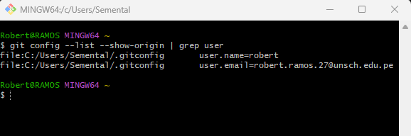
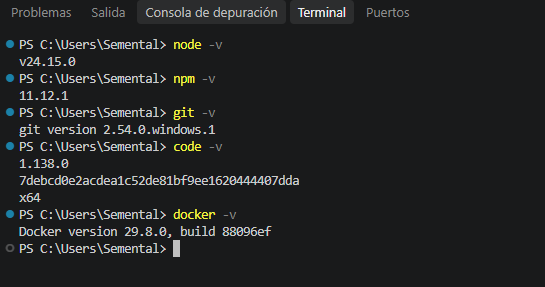
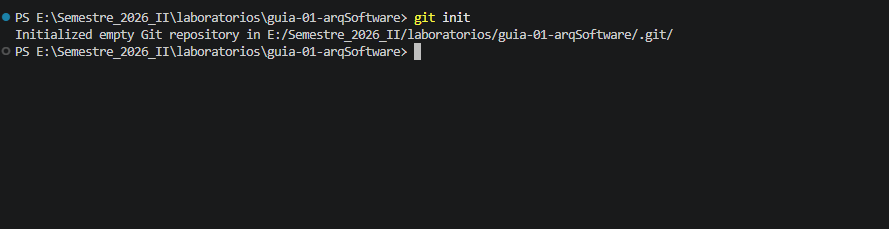
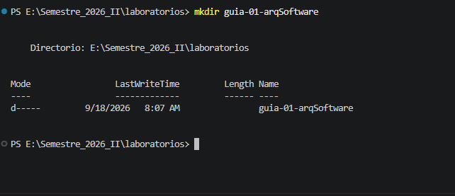
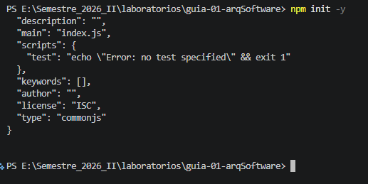
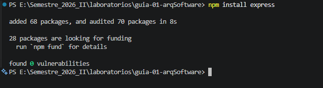
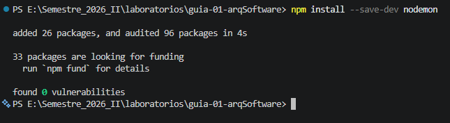
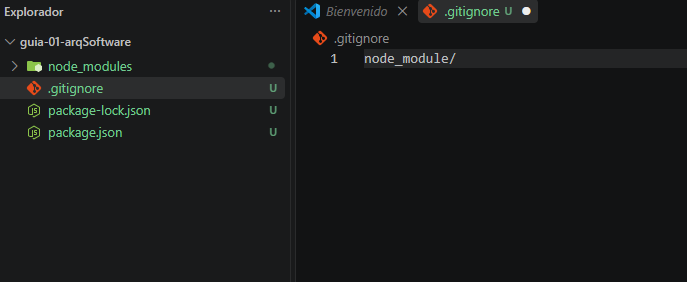

ESTUDIANTE: RAMOS QUINTANILLA, Robert briceño

ASIGNATRUA: ARQUITECTRU DE SOFTWARE (IS-488)

La asignatura de Arquitectura de Software se enfoca en el diseño y organización de sistemas de software complejos. Permite aprender a estructurar aplicaciones mediante componentes, capas, patrones arquitectónicos y buenas prácticas, con el objetivo de desarrollar sistemas mantenibles, escalables y de calidad que respondan a las necesidades de los usuarios y las organizaciones.

MIS ESPECTATIVAS:

Tengo altas expectativas respecto a la asignatura de Arquitectura de Software, ya que considero que es una de las áreas más importantes en el desarrollo de sistemas. Espero adquirir conocimientos sólidos sobre el diseño y la organización de aplicaciones, aprender nuevas metodologías y fortalecer mis habilidades para construir soluciones tecnológicas eficientes. Asimismo, espero que los contenidos y proyectos del curso contribuyan significativamente a mi formación profesional.

## Evidencias

### Imagen 1

### Imagen 2

### Imagen 3

### Imagen 4

### Imagen 5

### Imagen 6

### Imagen 7

### Imagen 8
